<div align="center">

#  Campus PE Internship Assignment

### Python Programming Solutions — Kowshik BH


</div>

---

##  About This Repository

This repository contains all solutions developed as part of the **CampusPE Internship Assignment**. Each program has been carefully written, tested with multiple input values, and documented with execution screenshots.

| Category | Count |
|---|---|
| ✅ Normal Questions | 20 |
| ⭐ Bonus Questions | 3 |
| 📸 Screenshots | 23 |
| **Total Solved** | **23** |

---

## Topics Covered

- **Python Fundamentals** — Variables, data types, operators, I/O
- **Functions & Modular Programming** — Reusable functions, return values, scope
- **Loops & Conditionals** — `for`, `while`, `if-elif-else` logic
- **Mathematical Computations** — Arithmetic, algebra, number theory
- **Text Processing** — String manipulation, slicing, formatting
- **Statistical Analysis** — Mean, median, mode
- **Mini Projects** — ATM Simulator, Guessing Game, Calculator, and more

---

## 📂 Project Structure

```
CampusPe_assignment_2/
│
├── screenshots/
│   ├── pro1.png  ──► pro20.png     # Normal Questions (1–20)
│   └── pro21.png ──► pro23.png     # Bonus Questions (21–23)
│
├── pro_1_personal_bio_card.py
├── pro_2_simple_calculator.py
├── pro_3_string_manipulator.py
├── pro_4_age_calculator.py
├── pro_5_bill_splitter.py
├── pro_6_grade_calculator.py
├── pro_7_temperature_converter.py
├── pro_8_leap_year_checker.py
├── pro_9_ticket_pricing.py
├── pro_10_atm_simulator.py
├── pro_11_pattern_printer.py
├── pro_12_table_generator.py
├── pro_13_sum_avg_calculator.py
├── pro_13_sum_avg_calculator_bonus.py
├── pro_14_factorial_calculator.py
├── pro_15_prime_checker.py
├── pro_16_guessing_game.py
├── pro_16_guessing_game_bonus.py
├── pro_17_palindrome_checker.py
├── pro_18_function_calculator.py
├── pro_18_function_calculator_bonus.py
├── pro_19_text_analysis.py
├── pro_20_number_system_functions.py
└── README.md
```

---

##  Programs Overview

| # | File | Topic |
|---|------|-------|
| 1 | `pro_1_personal_bio_card.py` | Personal Bio Card |
| 2 | `pro_2_simple_calculator.py` | Simple Calculator |
| 3 | `pro_3_string_manipulator.py` | String Manipulator |
| 4 | `pro_4_age_calculator.py` | Age Calculator |
| 5 | `pro_5_bill_splitter.py` | Bill Splitter |
| 6 | `pro_6_grade_calculator.py` | Grade Calculator |
| 7 | `pro_7_temperature_converter.py` | Temperature Converter |
| 8 | `pro_8_leap_year_checker.py` | Leap Year Checker |
| 9 | `pro_9_ticket_pricing.py` | Ticket Pricing System |
| 10 | `pro_10_atm_simulator.py` | ATM Simulator |
| 11 | `pro_11_pattern_printer.py` | Pattern Printer |
| 12 | `pro_12_table_generator.py` | Table Generator |
| 13 | `pro_13_sum_avg_calculator.py` | Sum & Average Calculator |
| 14 | `pro_14_factorial_calculator.py` | Factorial Calculator |
| 15 | `pro_15_prime_checker.py` | Prime Number Checker |
| 16 | `pro_16_guessing_game.py` | Guessing Game |
| 17 | `pro_17_palindrome_checker.py` | Palindrome Checker |
| 18 | `pro_18_function_calculator.py` | Function Calculator |
| 19 | `pro_19_text_analysis.py` | Text Analysis |
| 20 | `pro_20_number_system_functions.py` | Number System Functions |
| ⭐ B1 | `pro_13_sum_avg_calculator_bonus.py` | Bonus — Sum & Avg |
| ⭐ B2 | `pro_16_guessing_game_bonus.py` | Bonus — Guessing Game |
| ⭐ B3 | `pro_18_function_calculator_bonus.py` | Bonus — Function Calculator |

---

## 🔹 Normal Questions — Execution Screenshots

> All 20 programs tested with multiple inputs. Screenshots show sample execution outputs.

---

### ✅ Question 1 — Personal Bio Card

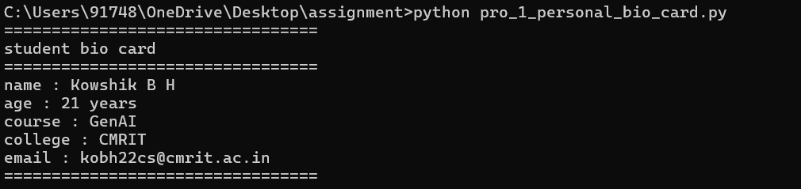

---

### ✅ Question 2 — Simple Calculator

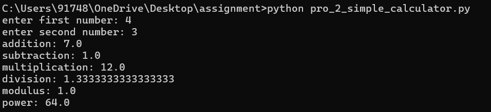

---

### ✅ Question 3 — String Manipulator

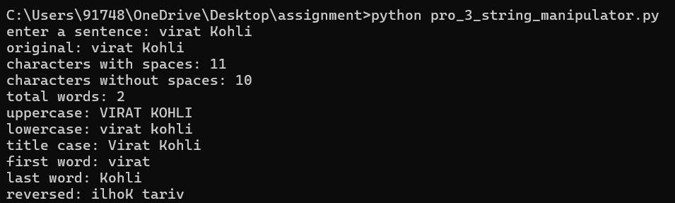

---

### ✅ Question 4 — Age Calculator

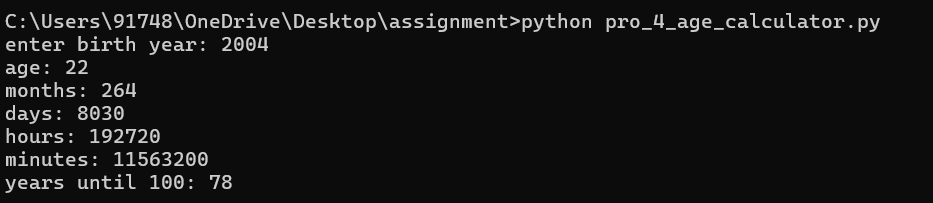

---

### ✅ Question 5 — Bill Splitter

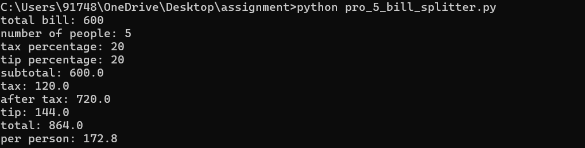

---

### ✅ Question 6 — Grade Calculator

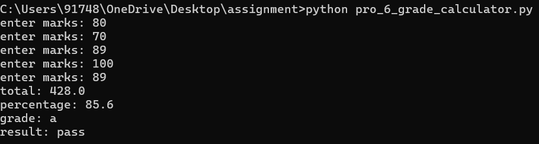

---

### ✅ Question 7 — Temperature Converter

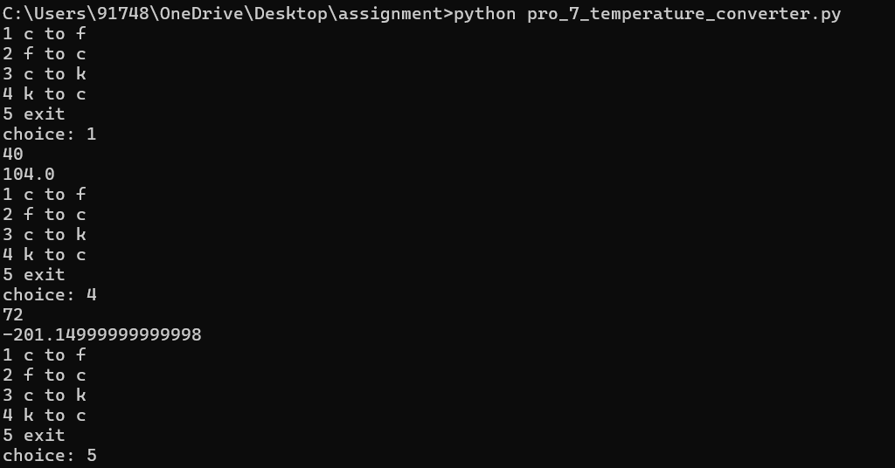

---

### ✅ Question 8 — Leap Year Checker

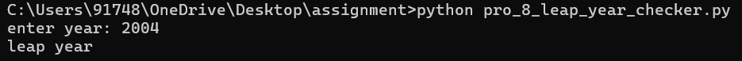

---

### ✅ Question 9 — Ticket Pricing System


---

### ✅ Question 10 — ATM Simulator

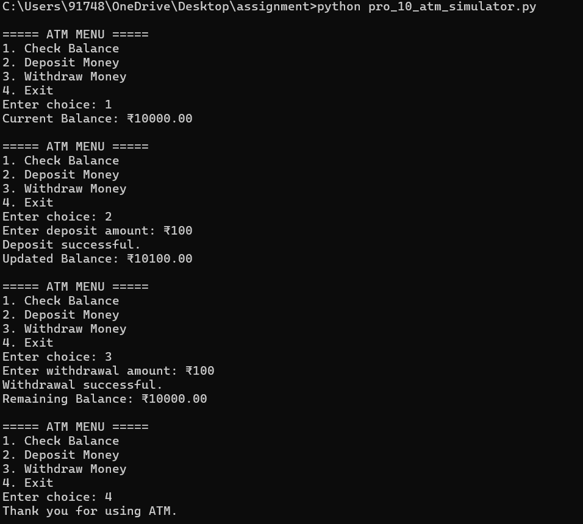

---

### ✅ Question 11 — Pattern Printer

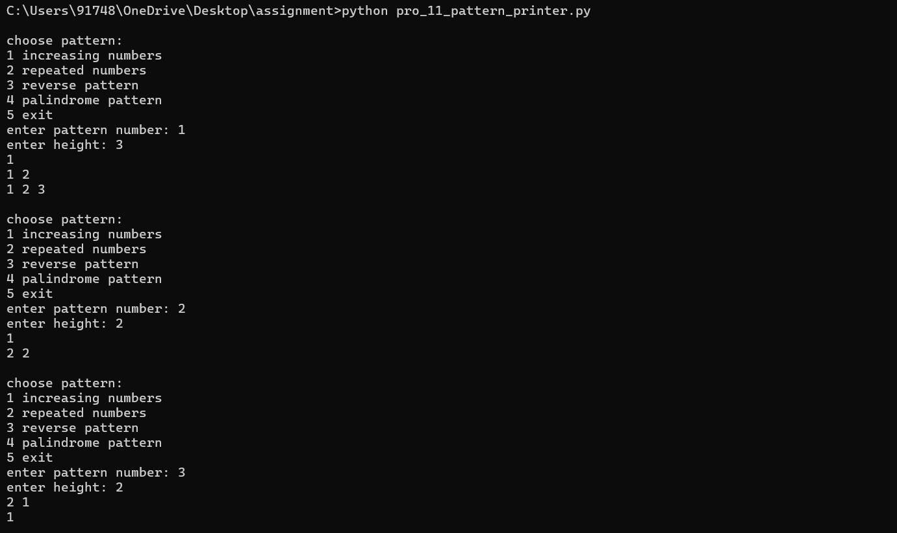

---

### ✅ Question 12 — Table Generator

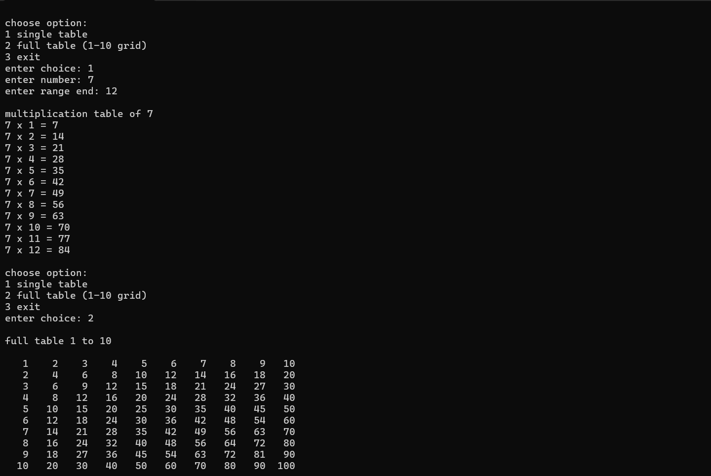

---

### ✅ Question 13 — Sum & Average Calculator

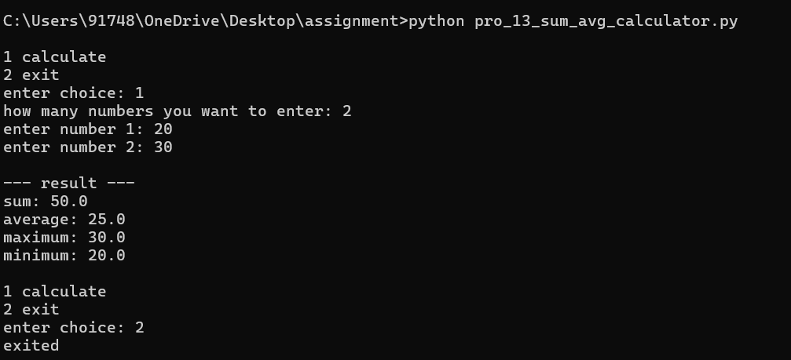

---

### ✅ Question 14 — Factorial Calculator


---

### ✅ Question 15 — Prime Number Checker

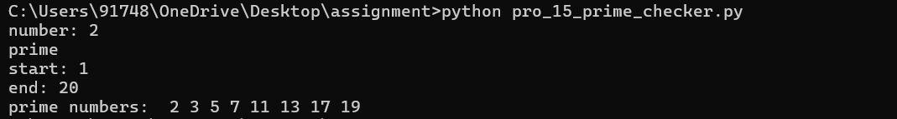

---

### ✅ Question 16 — Guessing Game

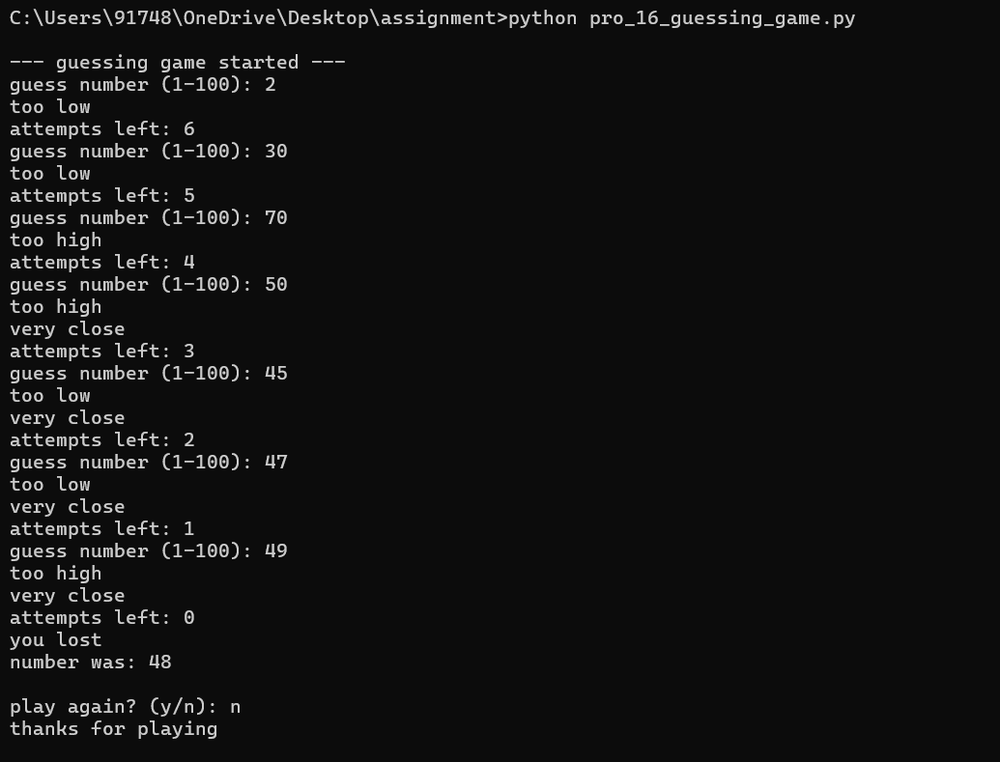

---

### ✅ Question 17 — Palindrome Checker

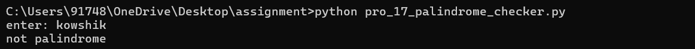

---

### ✅ Question 18 — Function Calculator

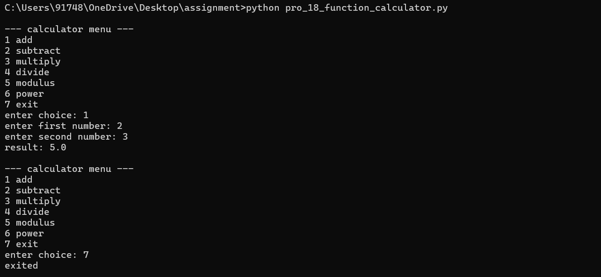

---

### ✅ Question 19 — Text Analysis

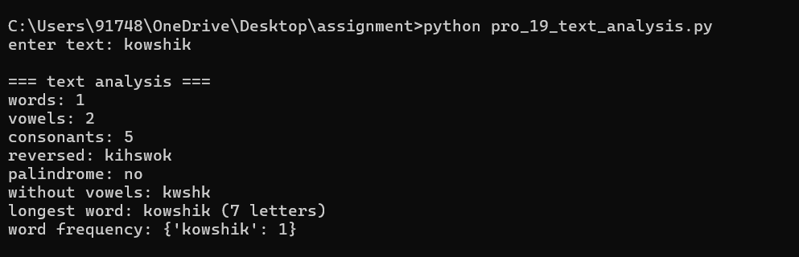

---

### ✅ Question 20 — Number System Functions

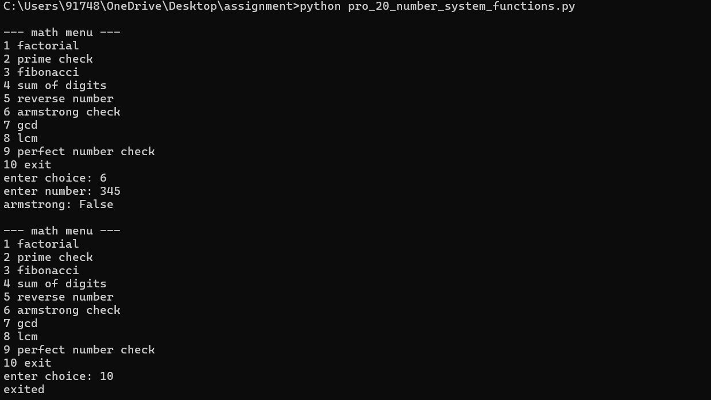

---

## ⭐ Bonus Questions — Execution Screenshots

> 3 additional bonus challenges completed successfully.

---

### ⭐ Bonus Question 1 — Sum & Average Calculator (Bonus)

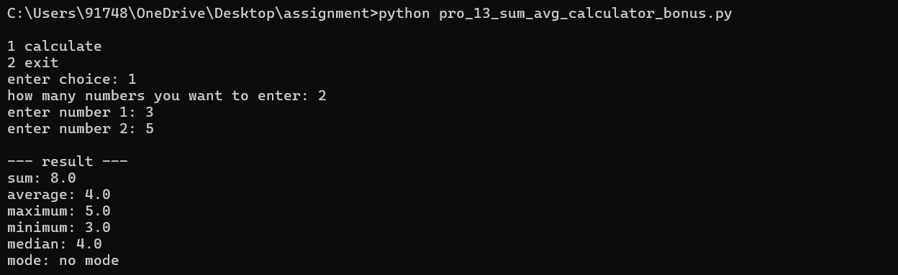

---

### ⭐ Bonus Question 2 — Guessing Game (Bonus)

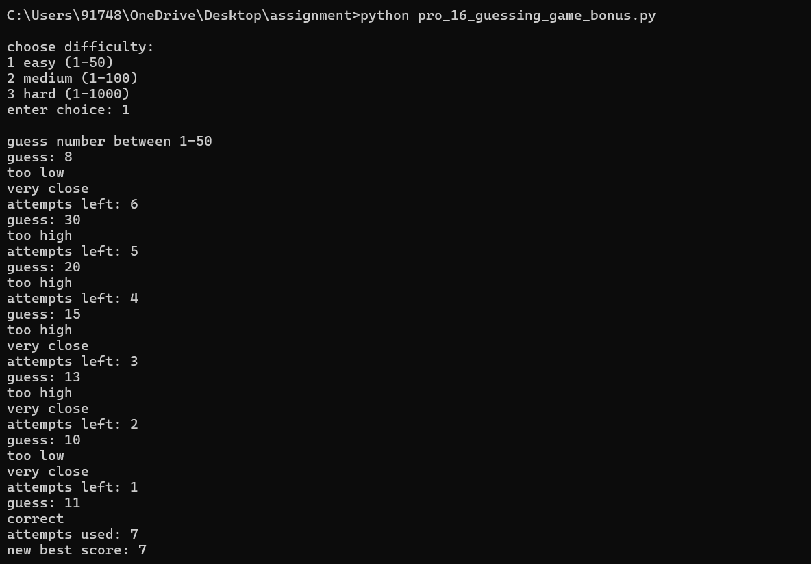

---

### ⭐ Bonus Question 3 — Function Calculator (Bonus)

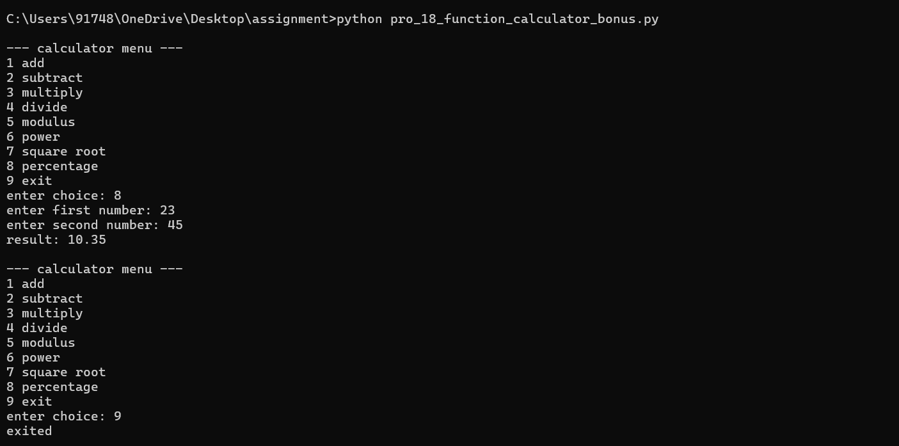

---

## 📝 Notes

- All programs were written in **Python 3**
- Every program was tested with **multiple input values** to verify correctness
- Screenshots are representative sample outputs and serve as proof of successful execution
- Programs follow clean, readable coding practices with appropriate comments

---

##  Contributor

<div align="center">

### Kowshik BH

[](mailto:kobh22cs@cmrit.ac.in)
[](https://www.linkedin.com/in/kowshikbh)
[](https://github.com/Kowshik-bh18)

</div>

---

<div align="center">
  <i>Made with ❤️ as part of the CampusPE Internship Program</i>
</div>
